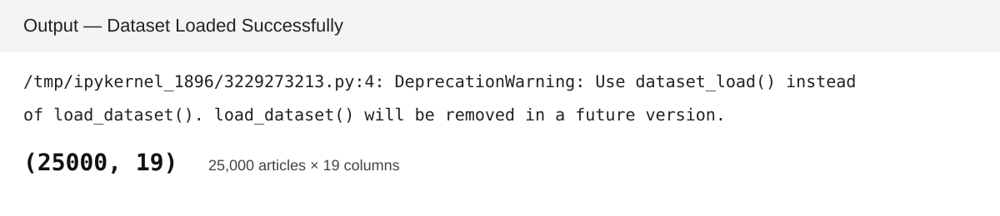
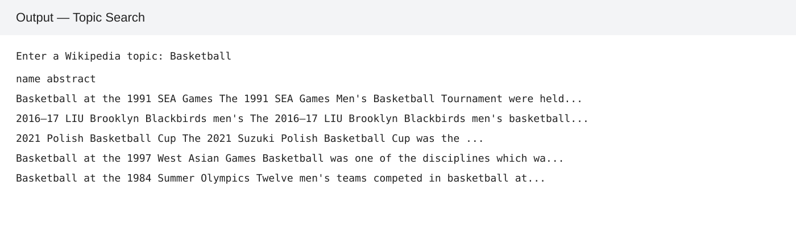
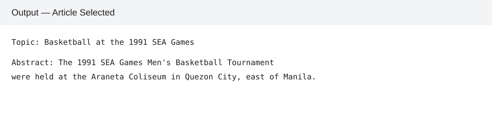
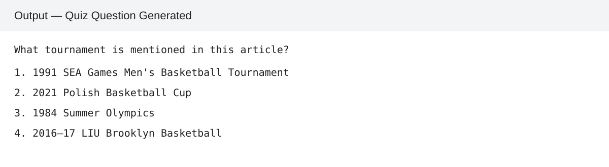
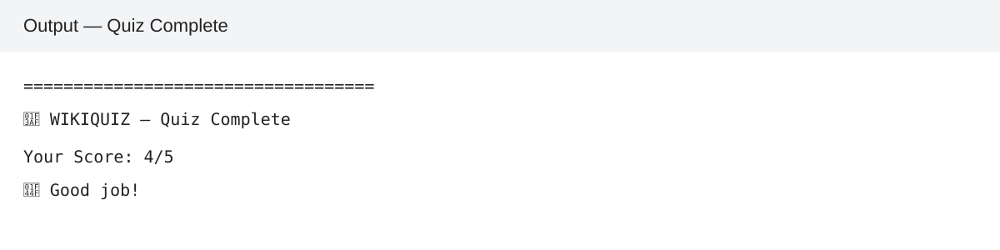

# 📸 WikiQuiz — Output Evidence

The repository now includes output evidence for the Challenge 1 prototype.

### 1. Dataset Loaded

### 2. Topic Search

### 3. Article Selected

### 4. Quiz Question Generated

### 5. Final Quiz Result

> These evidence images are based on the executed outputs present in the submitted WikiQuiz notebook. They are included so the GitHub repository visibly demonstrates the prototype flow.